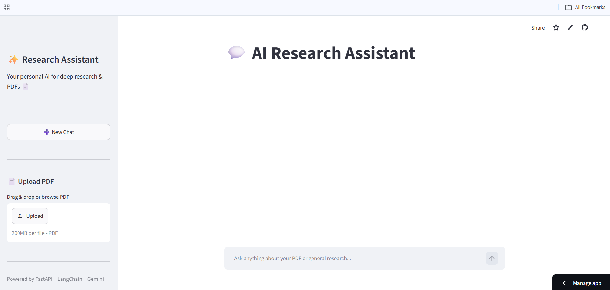

# ✨ AI Research Assistant

🔗 **Live Demo App:** [ai-research-assistant.streamlit.app](https://ai-research-assistant-wxs3ghe7u4hhfrxvetgae3.streamlit.app)  
⚙️ **Production API Gateway:** [ai-research-assistant-xku3.onrender.com](https://ai-research-assistant-xku3.onrender.com)

---

## 📋 Overview

The **AI Research Assistant** is a production-grade, multi-session RAG (Retrieval-Augmented Generation) platform designed to provide isolated, high-context document analysis and specialized task automation. Built using **FastAPI** and **Streamlit**, the application processes uploaded PDFs into session-isolated **FAISS** vector databases, eliminating data cross-contamination between chats. Queries are dynamically analyzed by a specialized supervisor chain and routed to dedicated agents (Research, Coding, Summary, or RAG) to provide exact, context-driven outputs powered by **Gemini 2.5 Flash**.

---

## ✨ Features

* **Multi-Session Vector Isolation:** Generates cryptographically secure, independent FAISS subfolders per session ID to prevent multi-user document data pollution.
* **Intelligent Query Routing:** Utilizes an LLM-driven supervisor router to dynamically analyze user prompts and hot-swap between processing tracks.
* **Specialized Agent Ecosystem:**
    * *RAG Analyzer:* Auto-triggers when deep document context matching an L2 Euclidean threshold is detected.
    * *Coding Agent:* Specialized prompt architecture tailored for debugging, software design, and algorithmic optimization.
    * *Research Agent:* Configured for comprehensive analytical breakdowns and open-domain discovery tasks.
    * *Summary Agent:* Optimizes heavy context fields into structured, high-signal takeaway frameworks.
* **Persistent Chat History:** Seamless state management and chat retention backed by a local **SQLite** database module.
* **Production Telemetry:** Built-in hooks for **LangSmith Tracing** to track pipeline execution latency, cost telemetry, and model node parameters.

---

## 🛠️ Technologies Used

### **Frontend:**
* Streamlit (Custom UI Injection)
* HTML5 & CSS3
* Requests (Asynchronous Event Polling)

### **Backend:**
* FastAPI
* Uvicorn (Asynchronous Server Gateway Interface)
* Pydantic v2 (Data Validation)
* Python-Multipart

### **Vector Store & AI Framework:**
* LangChain / LangChain Community
* FAISS (Facebook AI Similarity Search - CPU Optimized)
* Google GenAI Embeddings (`models/embedding-001`)
* Gemini 2.5 Flash (`gemini-2.5-flash`)
* PyMuPDF & PyPDF (High-Fidelity Document Layout Parsing)
* LangSmith (LLM Observability Engine)

### **Database:**
* SQLite (`chat_history.db`)

---

## 📂 Project Structure

```text
AI RESEARCH ASSISTANT/
│
├── agents/
│   ├── coding_agent.py
│   ├── research_agent.py
│   ├── router.py
│   └── summary_agent.py
│
├── faiss_index/
│
├── rag/
│   ├── embeddings.py
│   ├── pdf_loader.py
│   ├── rag_answer.py
│   ├── rag_chain.py
│   ├── retriever.py
│   ├── text_splitter.py
│   └── vector_store.py
│
├── uploads/
│
├── utils/
│   └── memory.py
│
├── .env
├── .gitignore
├── app.py
├── chat_history.db
├── database.py
├── frontend.py
└── requirements.txt

## 📸 Application Preview


